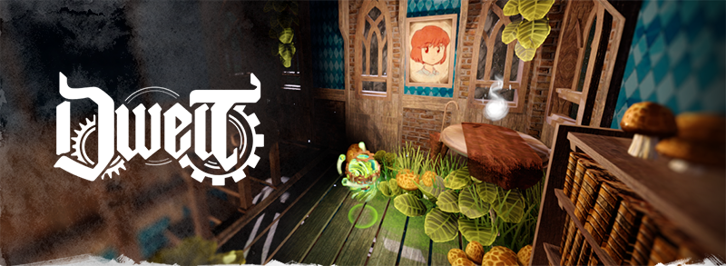

# Dwelt: Mechanical Dreams

> "A winter dragon, winding about their twisted spire of disquiet memory. Vines creeping; metals unforged; broadleaves heavy with weary tears of damp-scent. Echoes; order; wandering. Meet the gaze of the orrery; it will divulge that which the serpent conceals in its ages of mourning."

Dwelt is a world; a dreamscape in video game form. It's my hobby - a place to store my creations and express the places and feelings I see in dreams - and a portfolio. Dwelt is my scrappy attempt to combine my love of making music, 3D modeling, and illustration into a coherent and inhabitable place.
